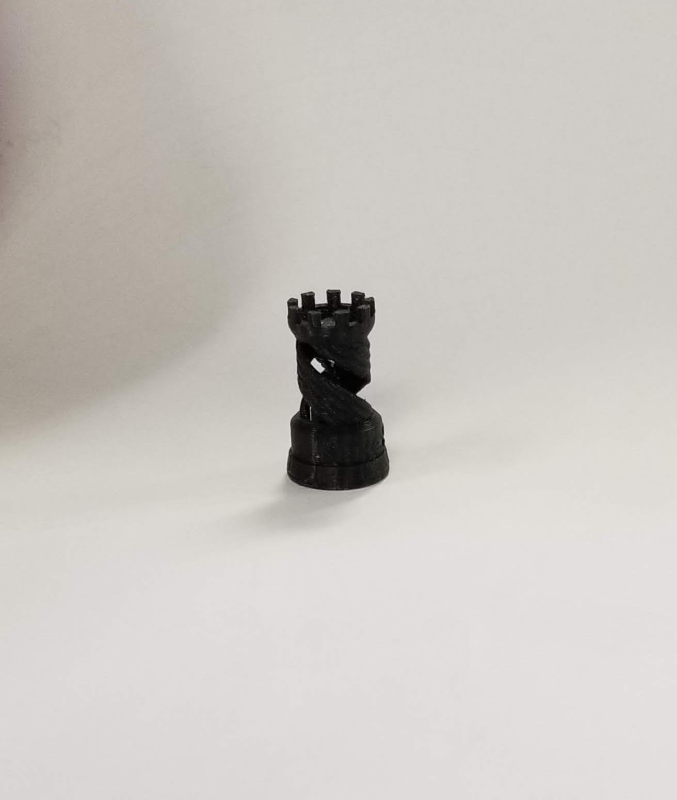

# Week 4: 3-D Printing

This week I downloaded a CAD file and learned to format it for 3-D printing and sent it over to the shop. It went over pretty well.  
There were a lot of supports printed but I was able to get them out with some tweezers and wire snips.

