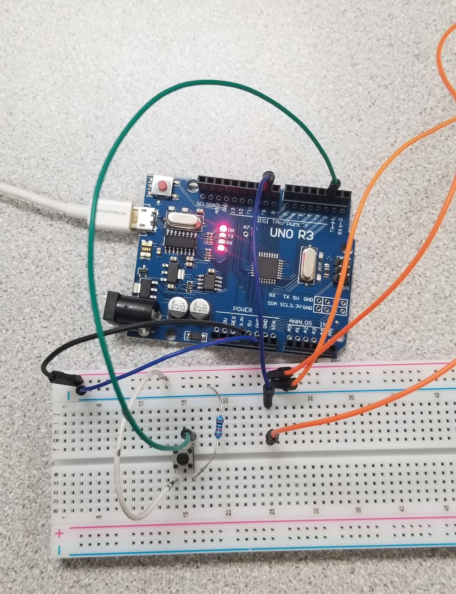
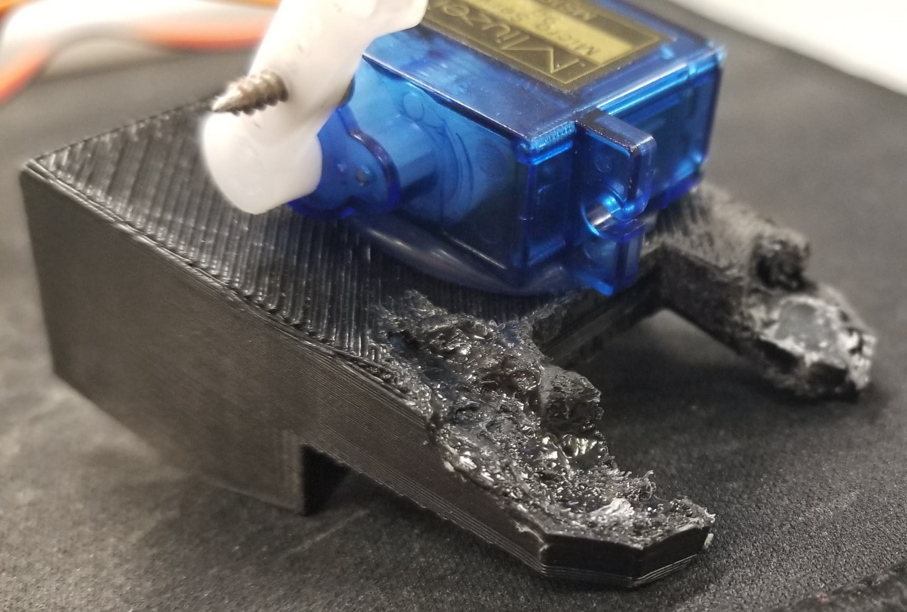

# Final Project: Nose Flute

## What I made:

Nose flute where you can control the volume

## Why I chose the nose flute:

It's weird and I thought it would be cool to do. Especially because it's so different.

## Used that I Learned from the class:

- CAD design in fusion 360
- 3-D printing
- revisited arduino and C
- revisited basic circuit design

## Design Process:

- Grabbed stl off of website
- 3-D printed nose flute stl



- learn about acoustic design and come up w/ mod ideas
  - putting blade at bottom like in imgs to make the flute more efficient, or louder
  - tube with holes like recorder attatched to the bottom flute hole that can change tone (didn't work)
    - did with short, thin paper tubes
- cut off some of bottom half of the flute
- made prototype using a thin piece of metal and found that I could control the volume

## Fabrication steps:

- get micro servo motor to move the piece of metal:
- used hole puncher for thin piece metal to make hole for screw
- attatched to arm I screwed together that goes on the motor
- to make room for arm I had to make a hole in the plastic so it could fit
  - with knife
  - with hot glue gun. this worked surprisingly well.
- scored back of motor chassis
- hot glued the motor to the nose flute
- used arduino to control motor



## Microcontroller

I used the motor by using the arduino, a breadboard, and a switch.  
The microcontroller I used was an arduino. I used the arduino IDE to program the arduino.

To set up the button I connected one of the ports of the button to ground and the other to 5V.
Between the button and ground I put a 10K ohm pull-down resistor to control the current.
I hooked up another port of the button to pin 10 on the Arduino to control it.
When the pushbutton is open (unpressed) there is no connection between the two legs of the pushbutton,
so the pin is connected to ground (through the pull-down resistor) and we read a LOW.
When the button is closed (pressed), it makes a connection between its two legs, connecting the pin to 5 volts, so that we read a HIGH.

Here's how everything was connected:  

  

Here's the code:
``` c
#include <Servo.h> 
 
Servo servo;  // create servo object to control a servo 
                // twelve servo objects can be created on most boards

const int buttonPin = 2;     // the number of the pushbutton pin
const int motorPin = 9;       // the number of the motor pin

int buttonState = 0;          // variable for reading the pushbutton status
int pos = 0;    // variable to store the servo position 
int angle = 97;

void setup()
{
  servo.attach(motorPin);  // attaches the servo on motorPin to the servo object
  servo.write(angle);
  pinMode(buttonPin, INPUT); // initialize the pushbutton pin as an input:
  while (digitalRead(buttonPin) == LOW) {} // doNothing
}

void loop()
{
  // scan from 97 to 180 degrees
  for(angle = 97; angle < 180; angle++)
  {
    while (digitalRead(buttonPin) == LOW) {} // doNothing
    servo.write(angle);
    delay(15);
  }
  // now scan back from 180 to 97 degrees
  for(angle = 180; angle >= 97; angle--)
  {
    while (digitalRead(buttonPin) == LOW) {} // doNothing
    servo.write(angle);
    if(angle == 97)
    {
      delay(250);
    }
    delay(15);
  }
}
```

## Final Product

When the button is pressed it moves from 97-180 degrees.  

This (video link)[https://photos.app.goo.gl/TNtic4PoJmcev7tH8] shows the code in action!

The image below shows the final prototype.  


## Conclusion

I was able to apply many things I learned in this class to my project.  
What I applied was:  
- CAD design in fusion 360
- 3-D printing
- input-output systems
- user interface
- revisited arduino and C
- revisited basic circuit design

I learned a lot from the class. I thought of it like a weightlifting class for creativity.
I don't normally take the time to lift and take care of my body as much as I should,
but if I take a lifting class I'll be motivated to show up for attendance.
I was able to flex my creativity muscles in this class much more than I would've on my own.
