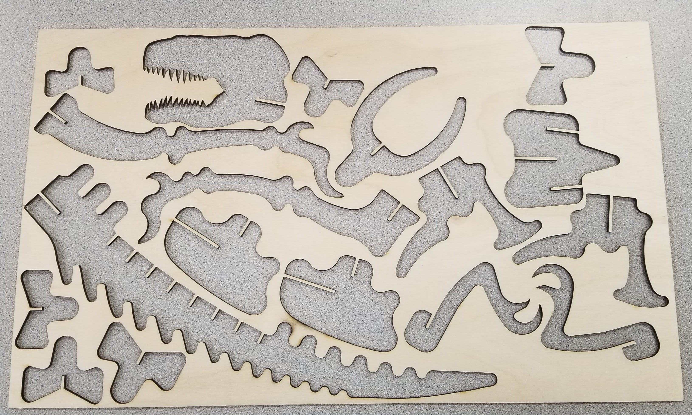
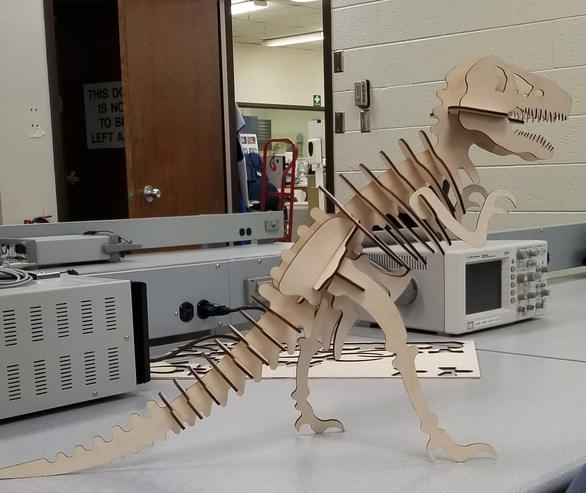

# Week 2: Laser Cutting

This week I decided to grab a model online of a skeleton of a dinosaur.  
I changed the sizing to make the slots fit the thickness of the wood I was using so it would fit snugly.

