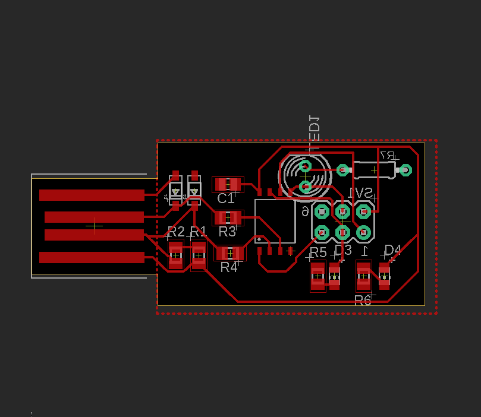
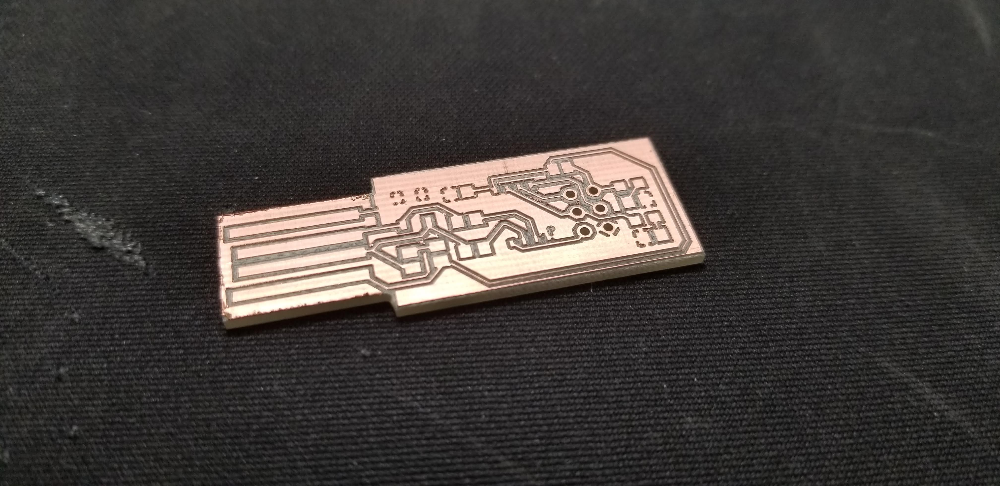
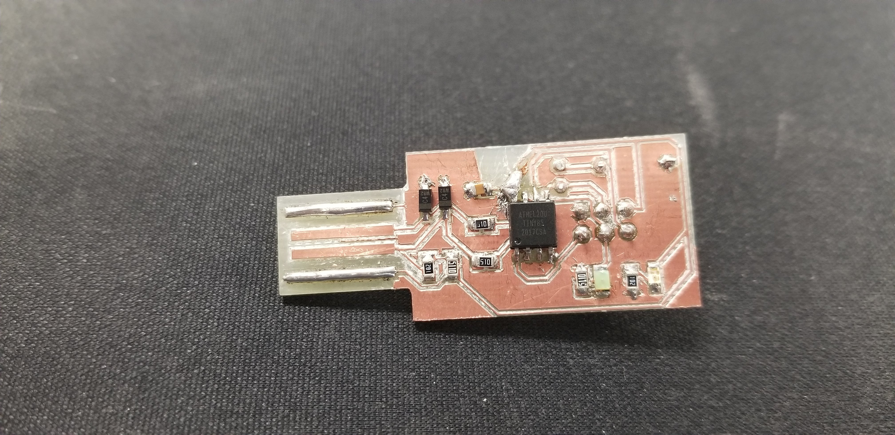

# Week 3

For week 3 we did a pcb design project. This one took up quite a bit of time.
I made an In Circuit Programmer on a PCB(printed circuit board) that I can plug into my computer. I made the design in eagle and sent the schematics into the shop to make the PCB. I then soldered on the parts. Surface mount soldering is trickier than with just wieres and pins. One of the parts is called attiny. It's a microcontroller like an arduino uno but smaller. I programmed the attiny to blink the LED on and off at 1s intervals when plugged in. The other LEDs are for letting me know if the device is on/plugged in/loading program. You could design this with a breadboard or protoboard but the goal was to make something small.





``` C
/*
  This program blinks pin 13 of the Arduino (the
  built-in LED)
*/

void setup()
{
  pinMode(13, OUTPUT);
}

void loop()
{
  // turn the LED on (HIGH is the voltage level)
  digitalWrite(13, HIGH);
  delay(1000); // Wait for 1000 millisecond(s)
  // turn the LED off by making the voltage LOW
  digitalWrite(13, LOW);
  delay(1000); // Wait for 1000 millisecond(s)
}
```
