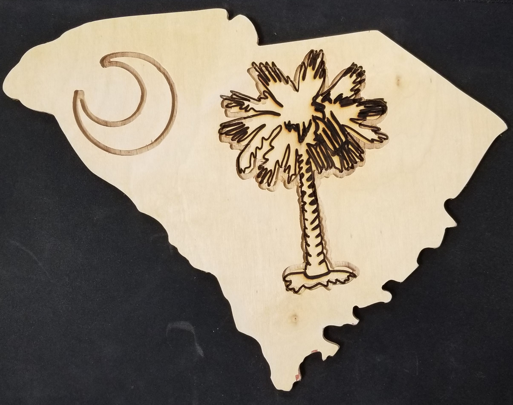

# Week 5: Computer-Controlled Machining

This week we learned about machining. This week's project was using a computer-controlled router to cut out indents in a piece of wood.  
I decided to make the flag of South Carolina over the state's geographical area. It was fun learning the basics of inkscape to be able to put together this project.

Here's part of the svg image that I used to make the flag in inkscape.

Here's the final product! I wanted to do something tricky and laser cut out the palmetto but the sizing didn't match up going from the router to the laser cutter. Next designs I make in the future will be much better!

