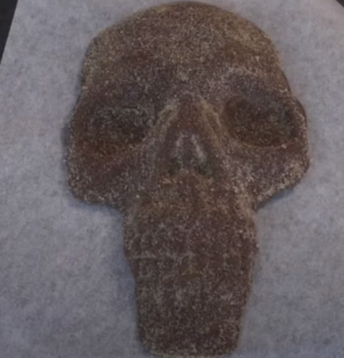
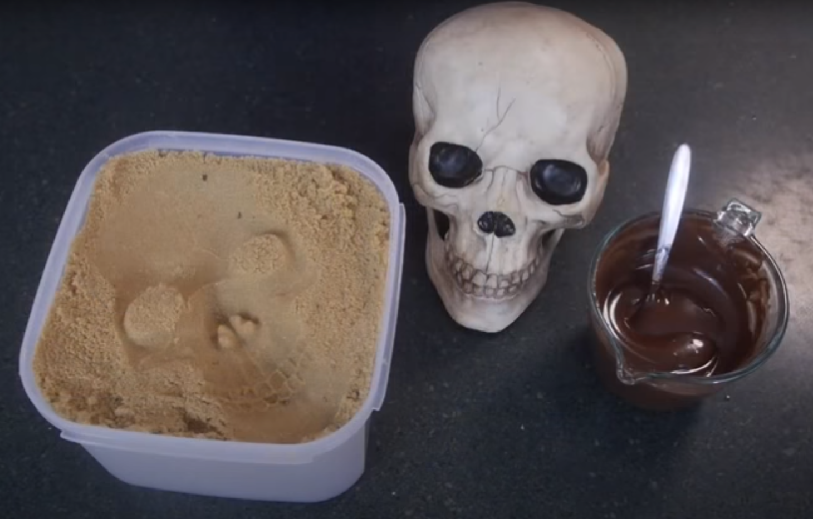

# Week 6: Molding and Casting

I did a sugar casting at home using sugar and chocolate for this week's project.

I used brown sugar to make a chocolate mold and grabbed a skeleton head that was lying around and imprinted it in the sugar and poured the chocolate in.

