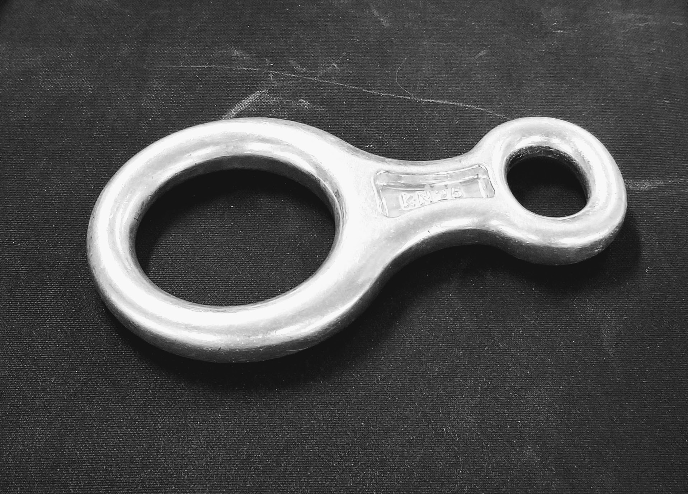

The plan is to modify my figure 8 in the shape of a dragon or some object using clay and then make the form in plaster.  
Dr. Smalley has a furnace I can use to turn around and change that plaster mold into a metal, such as aluminum.

Honestly I'll probably just do a sugar casting at home using sugar and chocolate.

