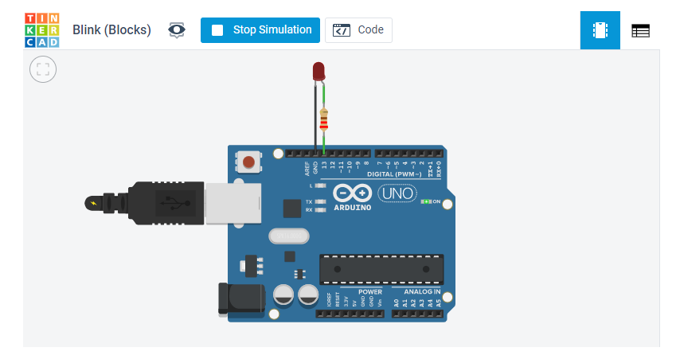
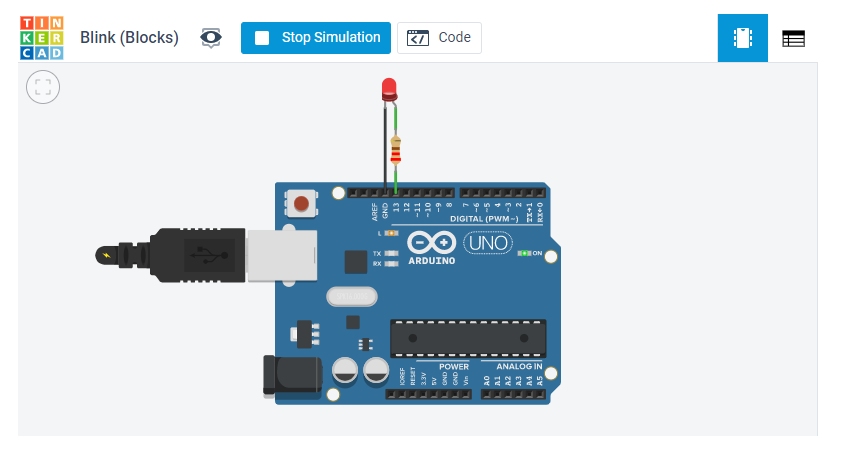
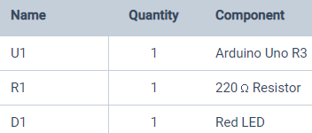

# Week 7: Embedded Programming

This week I made an arduino blink in tinkerCAD. It was eerily similar to what I did in week 3. :)

Here are some screenshots of the arduino off, on, and the parts used.

