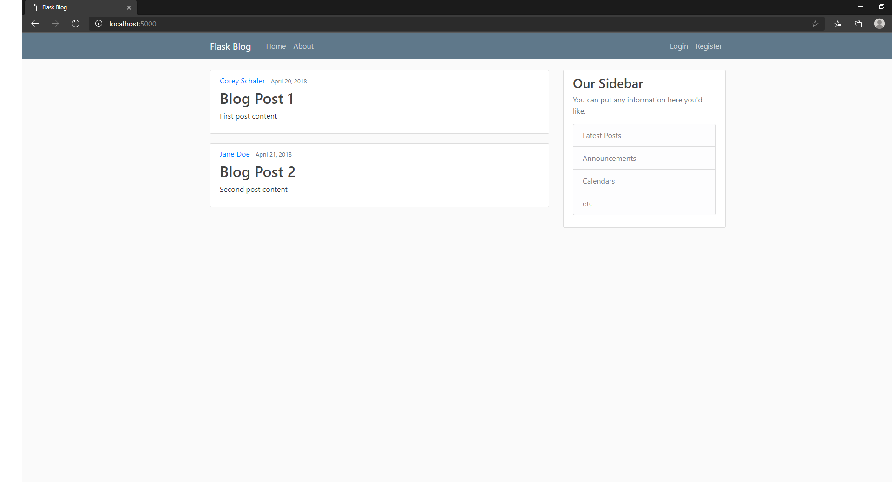

# Week 8: Interface and Application Programming

Weeks 8,9, and 10 are going to be combined in this project i'm doing.  
This week I set up a server on my laptop that I can control. I can only access it when my terminal and laptop are implementing the server.  
I then set up a basic home page on the server that uses the server to interface with my laptop, keyboard, and mouse.  
I also used templates to make it look nice. Ironic, considering I'm using the github website.  

__Home page:__



__Terminal output while running the server and clicking links:__

```
 * Serving Flask app "flask_blog" (lazy loading)
 * Environment: production
   WARNING: This is a development server. Do not use it in a production deployment.
   Use a production WSGI server instead.
 * Debug mode: on
 * Restarting with stat
C:\Users\Batman\Desktop\research\python_projects\flask\learn flask\.venv\lib\site-packages\flask_sqlalchemy\__init__.py:833: FSADeprecationWarning: SQLALCHEMY_TRACK_MODIFICATIONS 
adds significant overhead and will be disabled by default in the future.  Set it to True or False to suppress this warning.
  warnings.warn(FSADeprecationWarning(
 * Debugger is active!
 * Debugger PIN: 251-779-575
 * Running on http://127.0.0.1:5000/ (Press CTRL+C to quit)
127.0.0.1 - - [19/Nov/2020 16:32:18] "←[37mGET / HTTP/1.1←[0m" 200 -
127.0.0.1 - - [19/Nov/2020 16:32:19] "←[37mGET /static/main.css HTTP/1.1←[0m" 200 -
127.0.0.1 - - [19/Nov/2020 16:32:19] "←[33mGET /favicon.ico HTTP/1.1←[0m" 404 -
127.0.0.1 - - [19/Nov/2020 16:32:22] "←[37mGET / HTTP/1.1←[0m" 200 -
127.0.0.1 - - [19/Nov/2020 16:32:22] "←[37mGET /home HTTP/1.1←[0m" 200 -
127.0.0.1 - - [19/Nov/2020 16:32:23] "←[37mGET /about HTTP/1.1←[0m" 200 -
127.0.0.1 - - [19/Nov/2020 16:32:24] "←[37mGET /login HTTP/1.1←[0m" 200 -
127.0.0.1 - - [19/Nov/2020 16:32:27] "←[37mGET / HTTP/1.1←[0m" 200 -
127.0.0.1 - - [19/Nov/2020 16:32:42] "←[37mGET / HTTP/1.1←[0m" 200 -
127.0.0.1 - - [19/Nov/2020 16:32:42] "←[37mGET /static/main.css HTTP/1.1←[0m" 200 -
127.0.0.1 - - [19/Nov/2020 16:32:42] "←[33mGET /favicon.ico HTTP/1.1←[0m" 404 -
127.0.0.1 - - [19/Nov/2020 16:33:04] "←[37mGET / HTTP/1.1←[0m" 200 -
127.0.0.1 - - [19/Nov/2020 16:33:04] "←[37mGET /static/main.css HTTP/1.1←[0m" 200 -
127.0.0.1 - - [19/Nov/2020 16:33:04] "←[33mGET /favicon.ico HTTP/1.1←[0m" 404 -
127.0.0.1 - - [19/Nov/2020 16:34:05] "←[37mGET /login HTTP/1.1←[0m" 200 -
127.0.0.1 - - [19/Nov/2020 16:34:05] "←[37mGET /home HTTP/1.1←[0m" 200 -
127.0.0.1 - - [19/Nov/2020 16:34:06] "←[37mGET /login HTTP/1.1←[0m" 200 -
127.0.0.1 - - [19/Nov/2020 16:34:07] "←[37mGET /home HTTP/1.1←[0m" 200 -
127.0.0.1 - - [19/Nov/2020 16:34:07] "←[37mGET /login HTTP/1.1←[0m" 200 -
127.0.0.1 - - [19/Nov/2020 16:34:10] "←[37mGET /register HTTP/1.1←[0m" 200 -
127.0.0.1 - - [19/Nov/2020 16:34:12] "←[37mGET /login HTTP/1.1←[0m" 200 -
127.0.0.1 - - [19/Nov/2020 16:34:12] "←[37mGET /home HTTP/1.1←[0m" 200 -
127.0.0.1 - - [19/Nov/2020 16:34:14] "←[37mGET /login HTTP/1.1←[0m" 200 -
127.0.0.1 - - [19/Nov/2020 16:34:38] "←[37mGET /register HTTP/1.1←[0m" 200 -
(learn_flask)
```
