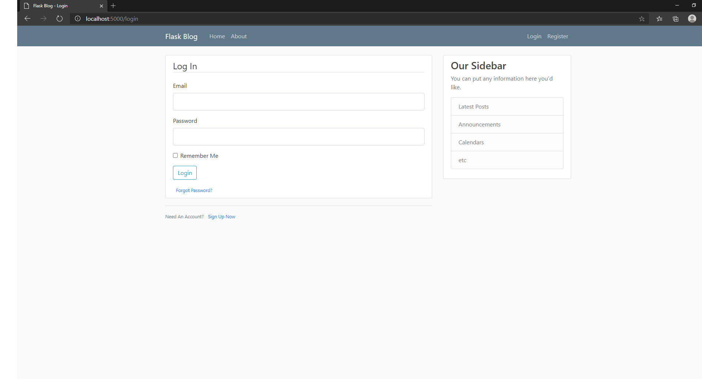
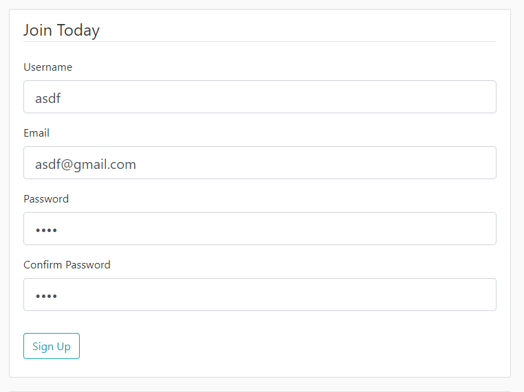

# Week 9: Input Devices

Weeks 8,9, and 10 are a single project split into parts.

I made it so that you can input data into my server using the website and store data.

Here's the login page where you can input data:

Here's where you can register your account:

