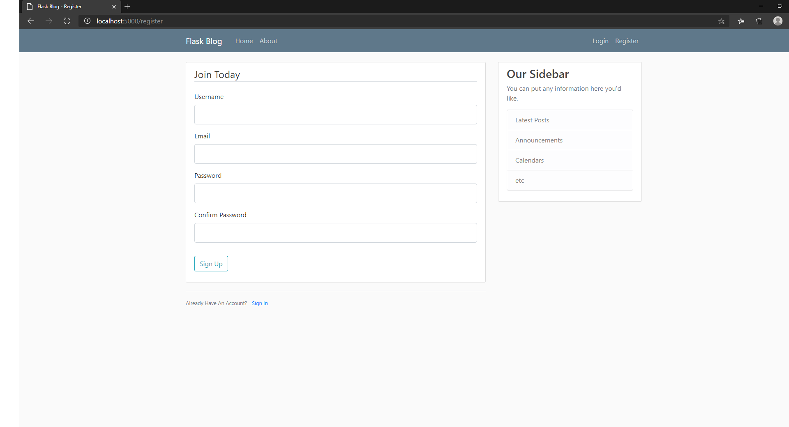

# Week 9: Input Devices

Weeks 8,9, and 10 are a single project split into parts.

I made it so that you can input data into my server using a web browser and store it.

Here's the login page where you can input data:

You can register an account by clicking Register or sign up now on the Login page:

Typing in data:

