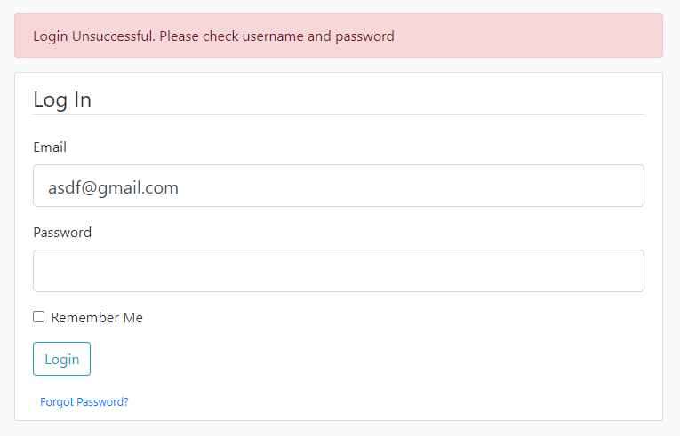
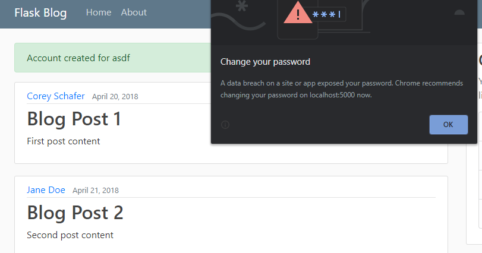

# Week 10: Output Devices

Weeks 8,9, and 10 are a single project split into parts.  
Instead of using microcontroller to connect to an output device I used my server as the output device.  
You can receive the outputs from the server through a web browser.  
These outputs are temporary error and confirmation flags that appear on the web page.  


When I enter in a duplicate account it won't create the account and displays an error.
When I login with the wrong username or password it also displays the error.
When I create an account using a proper e-mail, user name, and password it displays an affirmation.
Funny thing is that google doesn't like the fake password I put in and warned me that I should change it immediately.






Here's some sample code of my server that reads all my data.

``` python
from flask import Flask, render_template, url_for, flash, redirect
from flask_sqlalchemy import SQLAlchemy
from forms import RegistrationForm, LoginForm

app = Flask(__name__)
app.config['SECRET_KEY'] = 'e842acdf0b0fb6321961c0789c86be06'
app.config['SQLALCHEMY_DATABASE_URI'] = 'sqlite:///site.db'
db = SQLAlchemy(app)


class User(db.Model):
    id = db.Column(db.Integer, primary_key=True)
    username = db.Column(db.String(20), unique=True, nullable=False)
    email = db.Column(db.String(120), unique=True, nullable=False)
    image_file = db.Column(db.String(20),
                           nullable=False,
                           default='default.jpg')
    password = db.Column(db.String(60), nullable=False)

    def __repr__(self):
        return f"User('{self.username}','{self.email}', '{self.image_file}')"


posts = [{
    'author': 'Corey Schafer',
    'title': 'Blog Post 1',
    'content': 'First post content',
    'date_posted': 'April 20, 2018'
}, {
    'author': 'Jane Doe',
    'title': 'Blog Post 2',
    'content': 'Second post content',
    'date_posted': 'April 21, 2018'
}]


@app.route('/')
@app.route('/home')
def home():
    return render_template('home.html', posts=posts)


@app.route('/about')
def about():
    return render_template('about.html', title='About')


@app.route('/register', methods=['GET', 'POST'])
def register():
    form = RegistrationForm()
    if form.validate_on_submit():
        flash(f'Account created for {form.username.data}', 'success')
        return redirect(url_for('home'))
    return render_template('register.html', title='Register', form=form)


@app.route('/login', methods=['GET', 'POST'])
def login():
    form = LoginForm()
    if form.validate_on_submit():
        if form.email.data == 'admin@blog.com' and form.password.data == 'password':
            flash('You have been logged in!', 'success')
            return redirect(url_for('home'))
        else:
            flash('Login Unsuccessful. Please check username and password',
                  'danger')
    return render_template('login.html', title='Login', form=form)


if __name__ == '__main__':
    app.run(debug=True)
```
