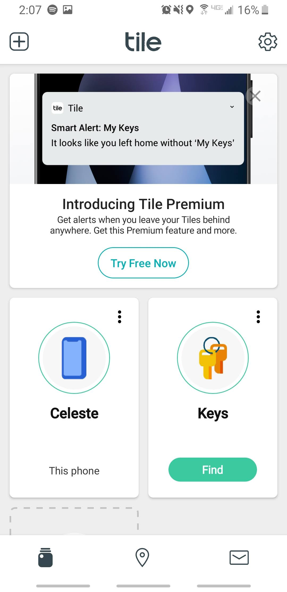
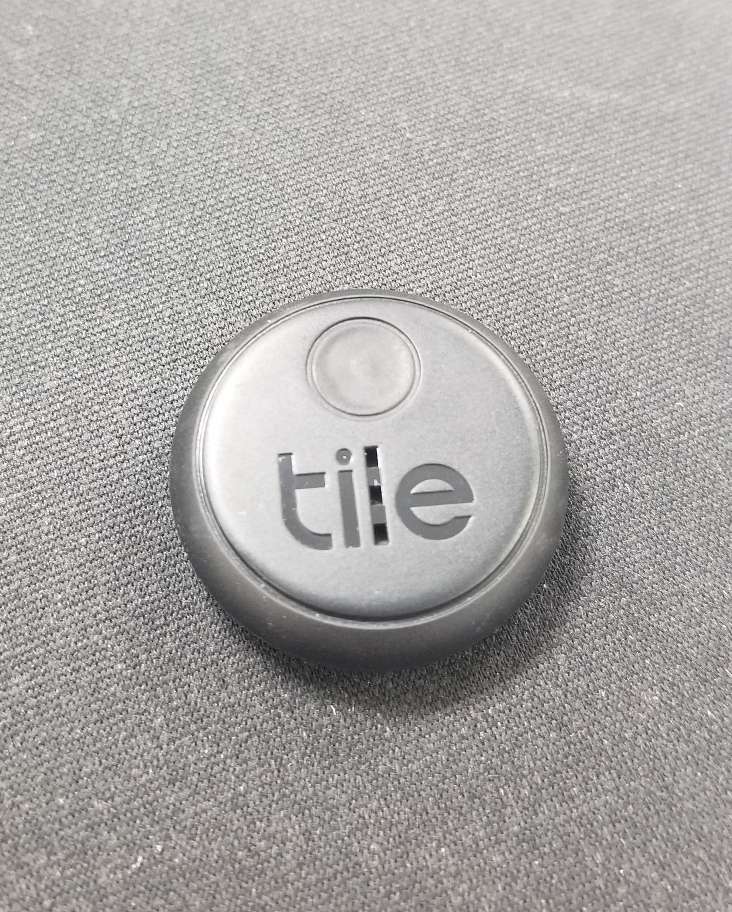

# Week 11: Networking and Communications

This week I set up tile to use with my phone and also keys using a tile sticker.

Tile was very intuitive and the setup was minimal.

For testing I took my keys and put them into another room and was able to find them using the tile app.

